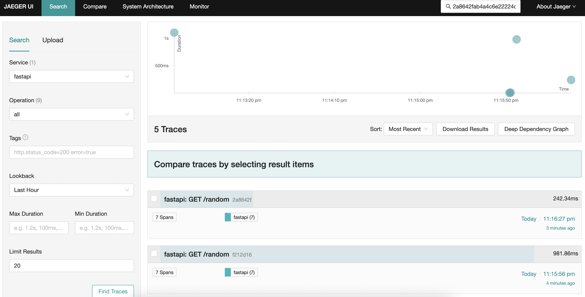

# fastapi-loki-tempo

FastAPI boilerplate for Loki and Tempo. 

Loki and Tempo is a very useful Open Source stack to combine logging + tracing.

## What is this?

1. Will convert all logs from `logging` module into json format, and each logs contain tracing ID,

```
{"written_at": "2023-10-01T15:16:27.952Z", "written_ts": 1696173387952311000, "msg": "I sleep for 0.23938469734819534 seconds", "type": "log", "logger": "root", "thread": "MainThread", "level": "INFO", "module": "app", "line_no": 23, "correlation_id": "7e2b2e38-606d-11ee-80fc-6905893e1fcd", "traceID": "2a8642fab4a4c6e22224ca24e8815670", "trace_message": "traceID=2a8642fab4a4c6e22224ca24e8815670", "dd.trace_id": "2460313556319557232"}
```

2. Support Loki tracing message `traceID=`, so this allow the users correlate Loki with Tempo.

## Installation

```bash
pip3 install git+https://github.com/huseinzol05/fastapi-loki-tempo
```

## Example

1. Run Tempo,

```bash
docker-compose -f tempo/docker-compose.yaml up --build
```

- Will forward GRPC OTLP at port `4317`.
- Will forward Jaeger UDP at port `6831`.

2. Run FastAPI,

Using OTLP,

```bash
OTLP_ENDPOINT=http://localhost:4317 uvicorn app:app --reload --host 0.0.0.0 --port 7072
```

Using Jaeger,

```bash
JAEGER_HOST=localhost JAEGER_PORT=6831 uvicorn app:app --reload --host 0.0.0.0 --port 7072
```

3. Request API at http://localhost:7072/random

```bash
curl -X 'GET' \
  'http://localhost:7072/random?minimum=0.1&maximum=2' \
  -H 'accept: application/json'
```

```
{"written_at": "2023-10-01T15:16:27.952Z", "written_ts": 1696173387952311000, "msg": "I sleep for 0.23938469734819534 seconds", "type": "log", "logger": "root", "thread": "MainThread", "level": "INFO", "module": "app", "line_no": 23, "correlation_id": "7e2b2e38-606d-11ee-80fc-6905893e1fcd", "traceID": "2a8642fab4a4c6e22224ca24e8815670", "trace_message": "traceID=2a8642fab4a4c6e22224ca24e8815670", "dd.trace_id": "2460313556319557232"}
{"written_at": "2023-10-01T15:16:28.192Z", "written_ts": 1696173388192492000, "type": "request", "correlation_id": "7e2b2e38-606d-11ee-80fc-6905893e1fcd", "remote_user": "-", "request": "/random", "referer": "http://localhost:7072/docs", "x_forwarded_for": "-", "protocol": "HTTP/1.1", "method": "GET", "remote_ip": "127.0.0.1", "request_size_b": -1, "remote_host": "127.0.0.1", "remote_port": 59378, "request_received_at": "2023-10-01T15:16:27.951Z", "response_time_ms": 240, "response_status": 200, "response_size_b": "51", "response_content_type": "application/json", "response_sent_at": "2023-10-01T15:16:28.192Z", "traceID": "2a8642fab4a4c6e22224ca24e8815670", "trace_message": "traceID=2a8642fab4a4c6e22224ca24e8815670", "dd.trace_id": "2460313556319557232"}
```

You can check Jaeger UI at http://localhost:16686,


